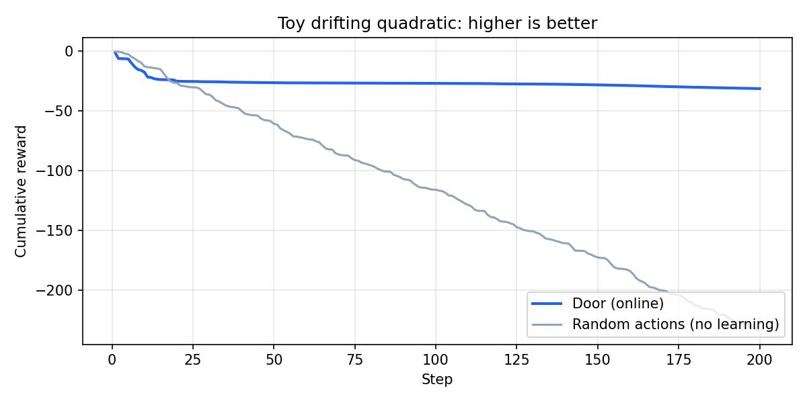

# Door (door-stabilizer)

[](https://pypi.org/project/door-stabilizer/)
[](https://pypi.org/project/door-stabilizer/)
[](https://pypi.org/project/door-stabilizer/)

**In one sentence:** give your simulator or toy plant an **`action → reward`** interface, then run an **online** loop that adapts actions when the dynamics drift — without designing a full policy by hand.

**Not:** a magic “auto-fix” for every real-world PID loop. You still **wrap your system** (sim or code) as `step(action) → reward` and choose the reward. See [Limitations](#limitations).

**Door** is a small **online adaptive control** library for Python: **`Door.act()`** and **`Door.update(reward)`**, with an **online surrogate** (ridge by default; optional **PyTorch** MLP), candidate scoring, light refinement, and exploration widening when reward variability spikes. Batch **`door.run`** is available with optional **N(t)**-style readouts.

**Install from PyPI** (import name is still `door`):

```bash
pip install door-stabilizer
```

Optional PyTorch surrogate:

```bash
pip install "door-stabilizer[torch]"
```

---

## Why use this?

- **Minimal API**: one incremental loop — no framework lock-in.
- **Same-physics budget** baselines: compare against CEM-restart style search on the same `plant.step` call budget (see benchmarks in the upstream research tree).
- **Lightweight core**: NumPy-only path works without PyTorch.

---

## Minimal example

```python
import numpy as np
from door import Door

class Plant:
    def step(self, a):
        return float(-np.sum(np.asarray(a) ** 2))

p = Plant()
ctrl = Door(dim=2, action_low=-1.0, action_high=1.0, seed=0)
for _ in range(100):
    u = ctrl.act()
    r = p.step(u)
    ctrl.update(r)
```

More examples live in [`examples/`](examples/).

### 60-second demo (plot)

Toy **drifting quadratic** (same plant for both curves; higher cumulative reward is better):

```bash
pip install door-stabilizer matplotlib
python examples/plot_learning_curve.py
```

Writes `door_vs_random_cumulative.png` in the current working directory (run from `examples/`). **Door vs random actions** on the same toy — not a temperature loop.



---

## Limitations

- **Not** a drop-in replacement for industrial PID blocks or vendor PLCs.
- **You** define the plant and reward (tracking error, smoothness penalty, etc.); Door searches actions **online** against that signal.
- Serious hardware needs your own safety review, rate limits, and validation — as with any learning-based controller.

---

## API sketch

| Piece | Role |
|--------|------|
| `Door.act()` | Propose next action from the current surrogate + exploration. |
| `Door.update(reward)` | Ingest reward and update the online model. |
| `door.run` | Batch rollout API with optional volatility widening and **N(t)** summary helpers. |

Aliases: `HAT` is kept as an alias for `Door` for compatibility with older notebooks.

---

## Version

Current release line: **0.4.x** on [PyPI — door-stabilizer](https://pypi.org/project/door-stabilizer/).

```bash
python -c "import door; print(door.__version__)"
```

---

## Repository name on GitHub

If the repo is still named **`door-stabalizer`**, rename it to **`door-stabilizer`** (correct spelling, matches PyPI). GitHub: **Settings → General → Repository name**.

---

## License

See [PyPI package metadata](https://pypi.org/project/door-stabilizer/) (Proprietary — BioQuant).

---

## Issues

Use **GitHub Issues** on this repository for install problems or documentation fixes.
